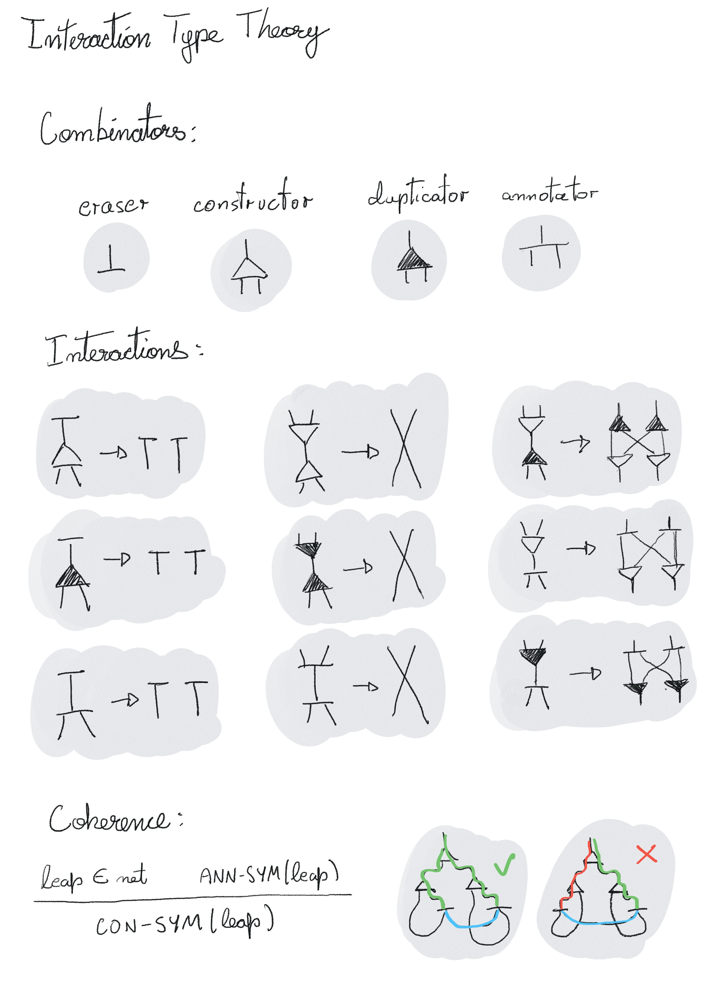
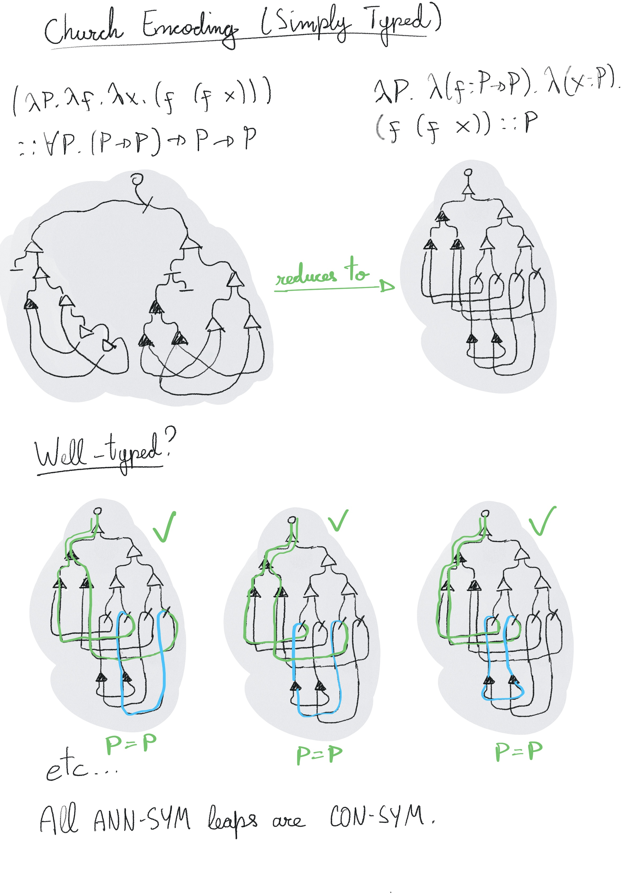

# Interaction Type Theory

ITT is a very simple extension to Symmetric Interaction Combinators that turns
this untyped model of computation into a fully featured logical framework,
capable of dependent type checking and theorem proving. This is done by adding a
single new combinator, "annotation", which enforces global symmetries between
subnets. That alone is sufficient to express a purely interactional type-checker
in a way that is analogue to a "Calculus of Constructions" on Interaction Nets.

**Note: this is a work in progress, this README is an un-reviewed draft, 
and the ITT system is still NOT implemented in this
repo, but will be soon. This is meant to be an extension of
[Interaction-Calculus](https://github.com/VictorTaelin/Interaction-Calculus)
with dependent types in a very natural way.**

Introduction
------------

[Interaction
Combinators](https://www.semanticscholar.org/paper/Interaction-Combinators-Lafont/6cfe09aa6e5da6ce98077b7a048cb1badd78cc76)
are a concurrent model of computation by Yves Lafont. It presents itself as a
simpler, more elegant and more efficient alternative to Turing Machines, Lambda
Calculus and others, offering a new perspective on what is *the true nature of
computation*.

One of the main achievements of Interaction Combinators is the optimal
implementation of the Lambda Calculus itself. There is a [1-to-1
translation](images/lambda_to_icomb.jpeg) from terms to nets, which allows us to
reduce λ-terms to their normal forms optimally. Sadly, that approach only works
for a subset of the λ-Calculus. While that subset is huge and sufficient to
encode most practical algorithms, a true functional runtime demands complete
λ-Calculus coverage. While solutions exist, they require overheads that impact
the real-world performance of the algorithm.

Now, while it is true that this mismatch between Interaction Combinators and the
Lambda Calculus may, for some, undermine its applicability as a functional
runtime, what few realize is that the Intearction Combinators aren't a just a
subset of the Lambda Calculus, they're overlapping sets. While some λ-terms,
such as self-exponentiation, don't have equivalents on Interaction Combinators,
the opposite is also true. For example, continuations, double-ended queues and
linear normalization-by-evaluation are important algorithms that can be
elegantly expressed on Interaction Combinators, but not on the λ-Calculus. This
raises the question: what if we treated Interaction Combinators as an
independent model of computation with its own merits, and promoted an
"interactional" paradigm, instead?

In order for such "interactional paradigm" to be compelling, it must be able to
serve as a foundation for type theory. Yet, while some typed extensions have
been proposed, they separate types as syntatically distinct objects from nets.
There is nothing that resembles the Calculus of Constructions, and that could be
used as an unifying language for types and programs, theorems and proofs, a la
Curry-Howard's isomorphism. Interaction Type Theory is a new logical framework
capable of fulfilling that role.

Interaction Type Theory
-----------------------

Interaction Type Theory (ITT) is obtained by extending Symmetric Interaction
Combinators with just 1 new combinator, the annotation (ANN), which, like
constructors (CON) and duplicators (DUP), has 3 ports, and follows identical
interaction rules. The complete system is illustrated below:



On top of that system, the following condition is imposed:

### The Coherence Condition

**An Interaction Type Theory net (ITT-net) is coherent if all its ann-symmetric
leaps are con-symmetric.**

A leap is similar to an execution, as defined by Yves Lafont, except that, for
each symbol (CON/DUP/ANN), one keeps both a stack and a queue. Then, when
entering a cell through its principal port with an empty relevant stack, rather
than stopping, one chooses one auxiliary port, appending it into a relevant
queue, and keeps traversing. This process halts when we reach the root port
again, completing a leap. The resulting stacks and queues are then checked for
symmetry. A leap is X-symmetric if its X-stack and X-queues are identical.  The
coherence condition dictates that, if a leap is ann-symmetric, it must be
con-symmetric. To better illustrate this concept, below is a pseudocode of a
potential coherence-checking algorithm:

```python
# Checks if an interaction combinator is coherent
def check(next, stacks, queues): 
  sym = next.symbol() # gets next symbol (CON, DUP or ANN)
  
  # If next is root, we completed a leap
  if next.is_root():
    # If leap is ann-symmetric, it must be con-symmetric too
    if stacks[ANN] == queues[ANN]:
        return stacks[CON] == queues[CON]
    return true # Irrelevant leap

  # Otherwise, if entering a main port...
  if next.port == 0:

    # If stack isn't empty, pop from stack and go to that port
    if stacks[sym].len() > 0:
      p0 = stacks[sym].get_last()
      s0 = {...stacks, [sym]: stacks[sym].without_last()}
      return check(next.goto(p0), s0, queues)

    # Otherwise, go to both aux ports and prepend them to queue
    else:
      q0 = {...queues, [sym]: [1] + queues[sym]}
      e0 = check(next.goto(1), stacks, q0)
      q1 = {...queues, [sym]: [2] + queues[sym]}
      e1 = check(next.goto(2), stacks, q1)
      return e0 && e1

  # Otherwise, push to stack and go to main port
  s0 = {...stacks, [sym]: stacks[sym] + [next.port]}
  return check(next.goto(0), s0, queues)
```

And that's all - this describes the entire system. What makes it interesting is
that coherence captures both equality and type-checking in a single algorithm,
thus, coherent ITT-nets correspond to well-typed terms in a logic emerging from
interaction combinators. As such, ITT can be used to write theorems and check
proofs, in the same way as the Calculus of Constructions (CoC). It could, in
theory, be used as an alternative foundation for mathematics, albeit a somewhat
esoteric one, at least for humans, but one that, in terms of raw complexity,
seems to be on the sharp side of Occam's Razor.

Now, of course, without further explanation, one may be confused regarding in
which sense the system above can be used as a dependent type checker. It is so
simple that it seems like something must be missing. Where is the dependent
function type (`Π (x: A) -> B x`)? Where are the universes? Where are the type
inference rules, definitional equality, and so on? Turns out all these can be
derived from the interactions of the ANN rule with the coherence condition, and,
perhaps surprisingly, even the non-standard, yet natural self-types can be
encoded, which mean ITT is capable of inductive reasoning without extensions.

To clear things up, the rest of this document will consist of many examples of
ITT terms and proofs, including CoC analogues to make sense of these nets.

Examples
--------

From now on, the λ-Calculus (and, respectively, the Calculus of Constructions)
will be used to illustrate programs and proofs on ITT. Keep in mind that this
will be done for pedagogical purposes: both systems are different, and, while
many proofs CoC terms can be interchanged by ITT nets, that isn't always true.

Before we get into types, let's familiarize ourselves with the optimal, 1-to-1
translation from the λ-Calculus to Interaction Combinators first.

...this article is a draft; since it is getting late and I want to have a rough
skeleton of this done, I'll just draw several examples and finish it futurely...




