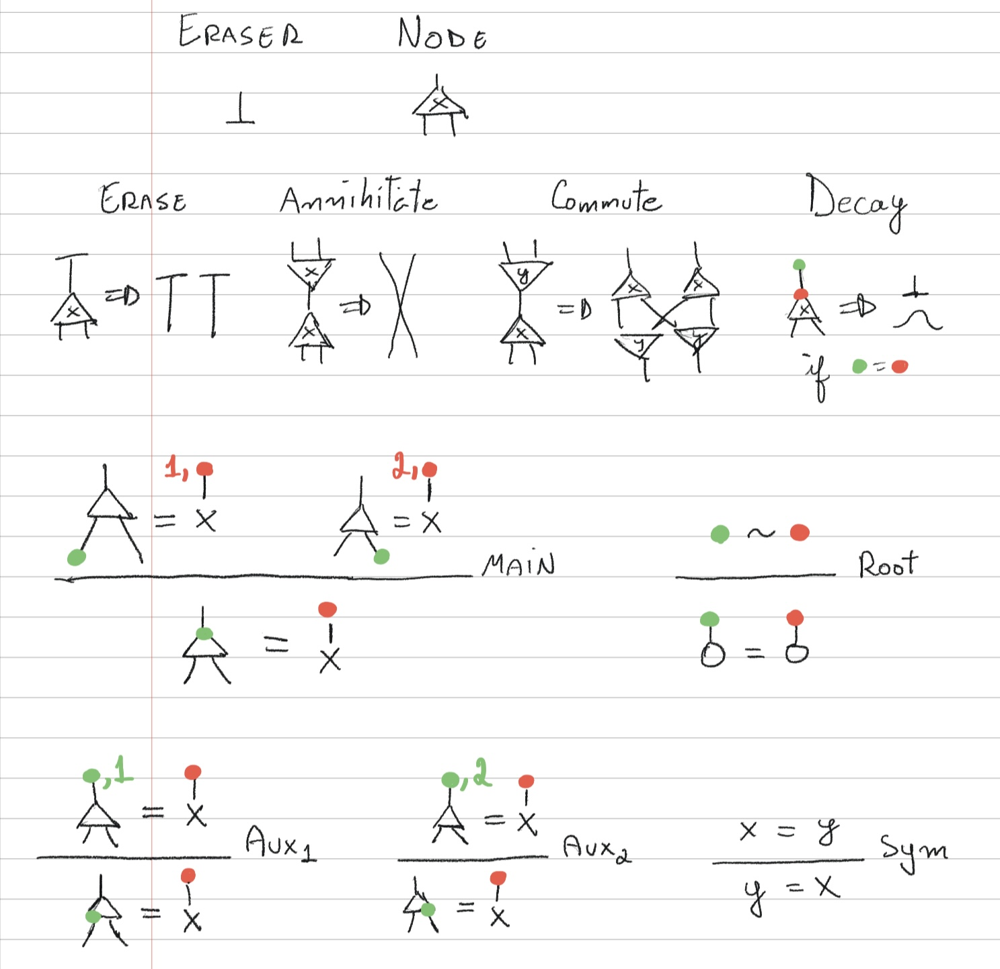
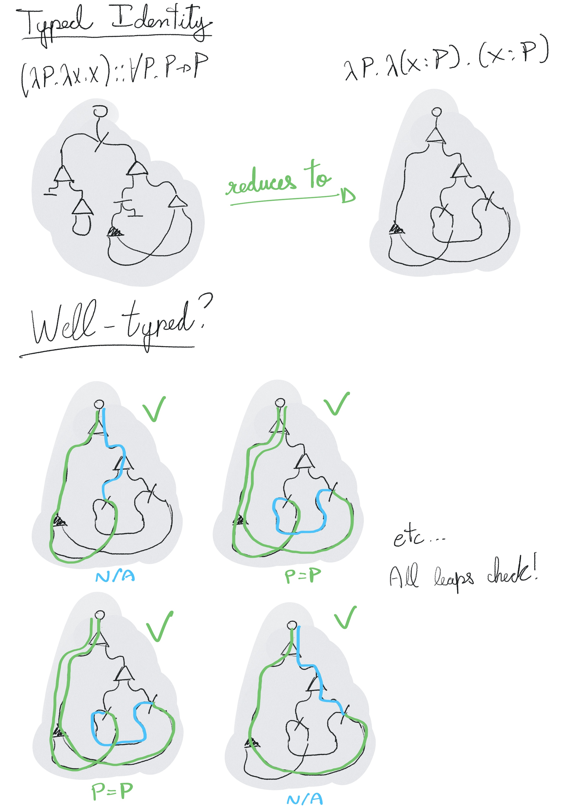
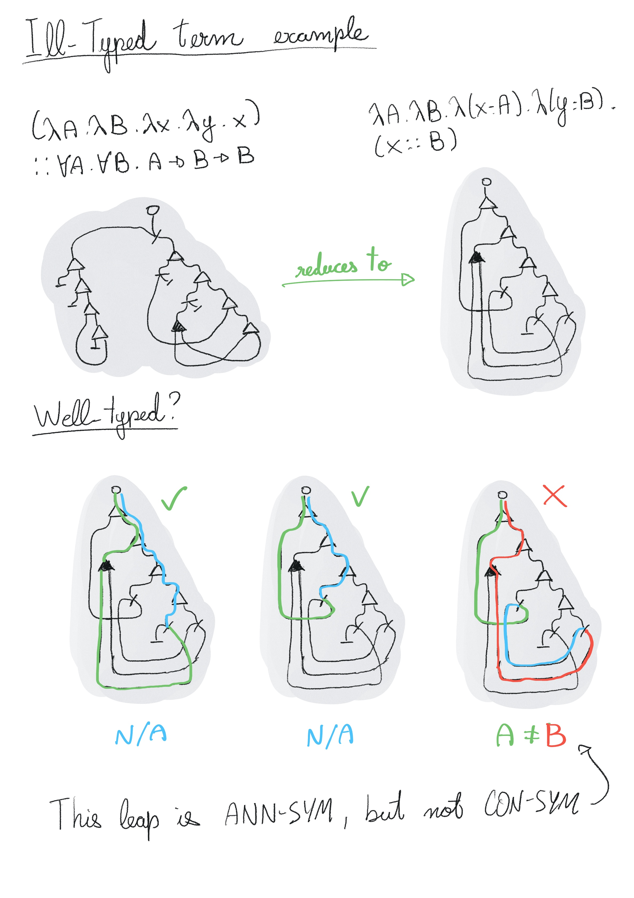
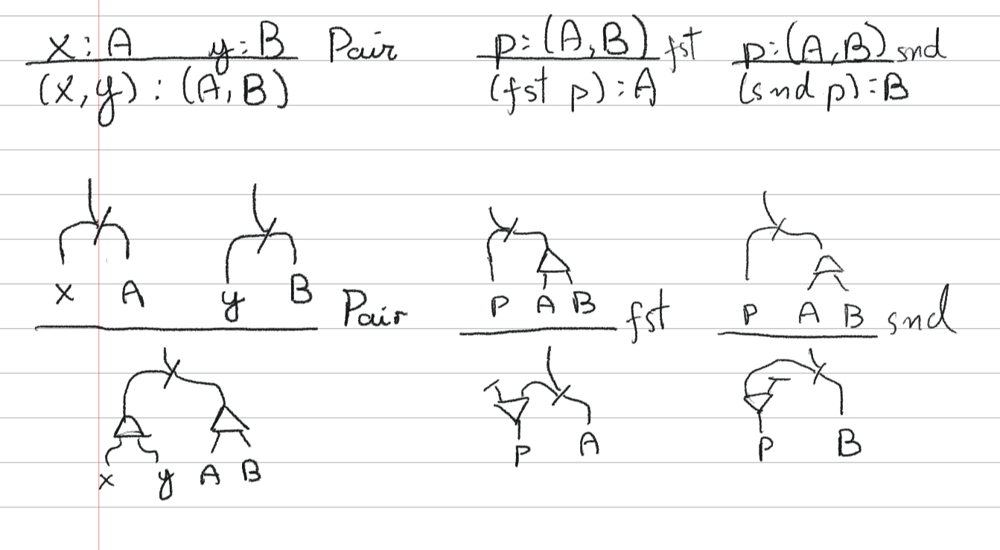
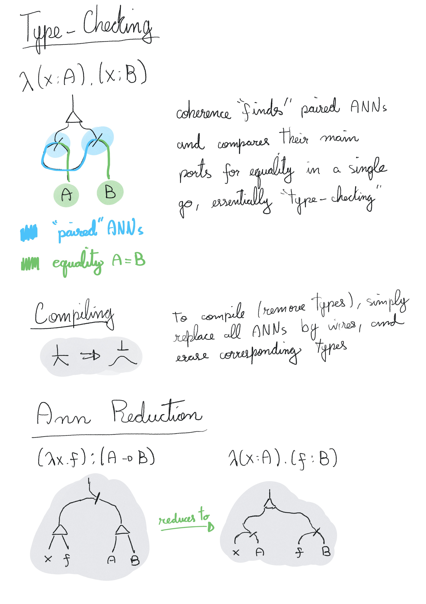
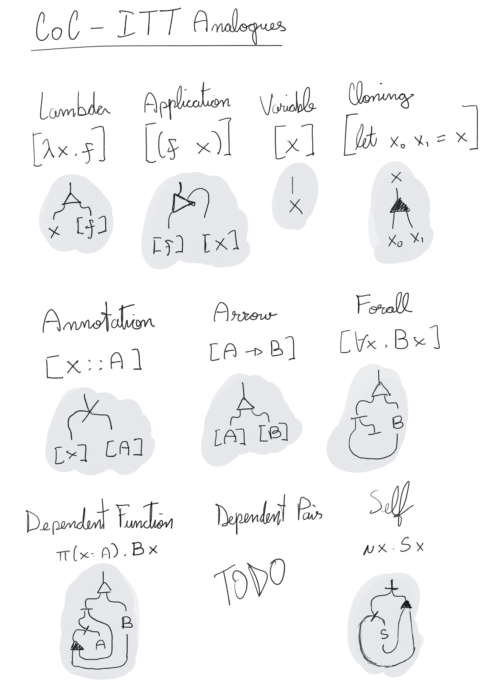

**Disclaimer: this is a work-in-progress. The claims made in this paper are
unchecked, and work is ongoing to explore, formalize and prove them rigorously.
Treat this as no more than private draft shared with friends.**

# Interaction Type Theory

What is the simplest system capable of logical reasoning? By extending
Interaction Combinators with a single new rule, "Decay", coupled with a global
coherence condition that enforces equalities of paired nodes, we're able to
construct a system capable of expressing propositions and checking proofs,
similar to the Calculus of Constructions. This system presents itself as an
extremely minimal "reasoning engine", with possible applications to program
synthesis and symbolic AI.

Specification
-------------

Interaction Type Theory (InTT) is obtained by extending Symmetric Interaction
Combinators (SIC) with a single new interaction rule, named Decay, which allows
a combinator to collapse to a wire and an eraser, when it respects the
**coherence condition**, which demands that both sides of its main wire are
demonstrably equivalent. We also allow for arbitrary combinator symbols, rather
than only two. And that's all. Below is a complete picture:

Notice the reduction rules are the usual ones on SIC, except for Decay, which
can only be triggered when its main wire respects the equivalence relation drawn
above. The red/green colors represent port locations, and `1,x`, `2,x`, `x,1`
and `x,2` represent appending to a local stack. Essentially, this equivalence
relation dictates that all paths outgoing from a port produce the same
"execution", as defined by Yves Lafont [citation], which also coincides with
Damiano Mazza's observational equivalence [citation].

What is surprising is the observation that this minimal system is capable of
encoding arbitrary types, propositions and proofs, in a way that is closely
connected to Type Theory and the Calculus of Constructions. This is done by
reserving a symbol for annotations (ANN), and then treating graphs connected to
the main port of an ANN nodes as types. Then, any net whose all ANN nodes can
decay (i.e., when the coherence condition is met) correspond to a valid proof in
a logic emerging from Interaction Combinators. Furthermore, the process of
decaying all ANN nodes corresponds to compiling, and the resulting process will
recover the original, untyped net - i.e., the program that encodes the proof.

For example, below is a net corresponding to `(λP. λx. x) :: ∀P. P -> P`, a
simple "proof" on CoC (identity):

And below is a net corresponding to `(λA. λB. λx. λy. x) :: ∀A. λB. A -> B ->
B`, which, this time, is an invalid (ill-typed) proof:

An attentive reader may have noticed that the picture above is lacking type
inference rules, which are part of all existing type theories. This isn't an
oversight: typing relations can be *encoded* on top of InTT, by providing
introduction and elimination rules to the type being encoded, and proving these
respect coherence. For example, below is an encoding for simple pairs:

The idea is that, by encoding the usual constructors of type theory, we can use
InTT as a logical framework capable of dependent type checking. This system
could be used as the core compilation target of a traditional type-checker, or
as a more natural structure for program synthesis and symbolic reasoning.

Below are some encodings of important λ-calculus terms:

